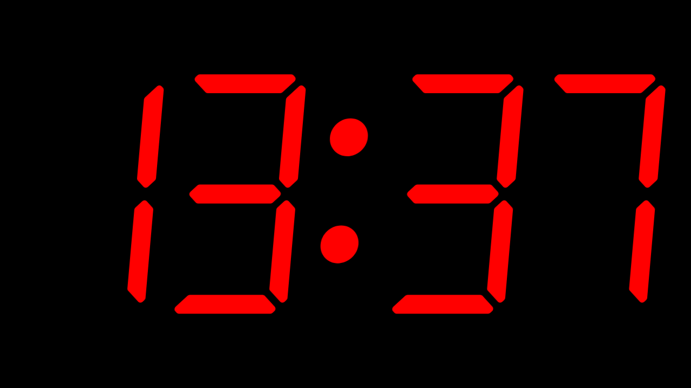

# Digital Clock

## Demo

https://slash-fr.github.io/digital-clock/

## Description

This small web app displays the current time, in the style of a
[seven-segment](https://en.wikipedia.org/wiki/Segment_display) digital clock:

There are *a few* settings, to customize the appearance of the clock (colors, time formatting, digit options, …):

The app also comes with 4 appearance presets:

> *But wait, there's more!*

Additional features:
- Uses a responsive layout (desktop / mobile devices)
- Works offline
- Displays the current time in the tab icon
- Synchronizes settings between tabs (in case you open the digital clock in multiple tabs simultaneously)

## License

GNU General Public License, version 3, or any later version (`GPL-3.0-or-later`).
